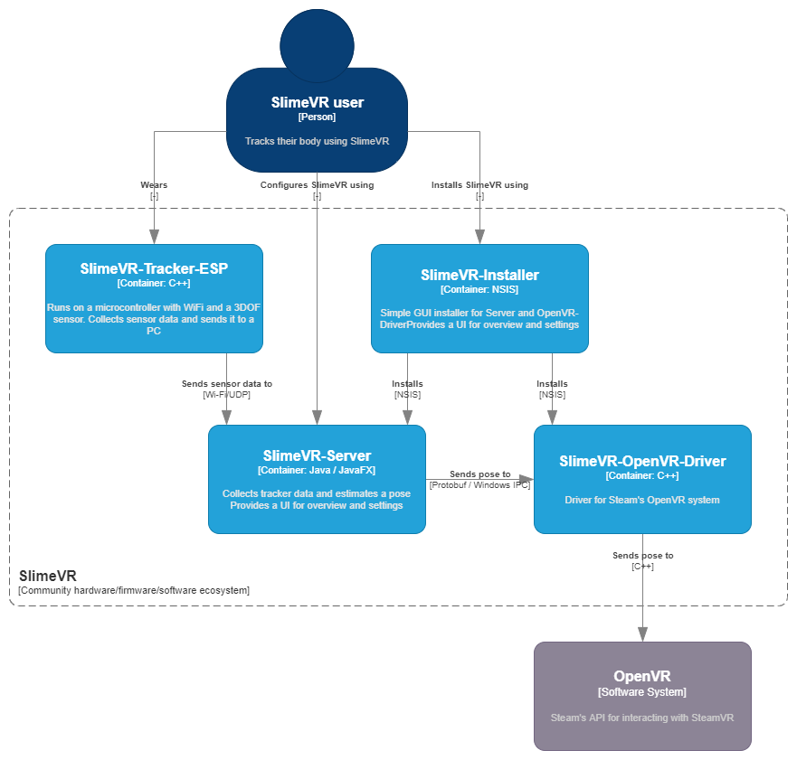
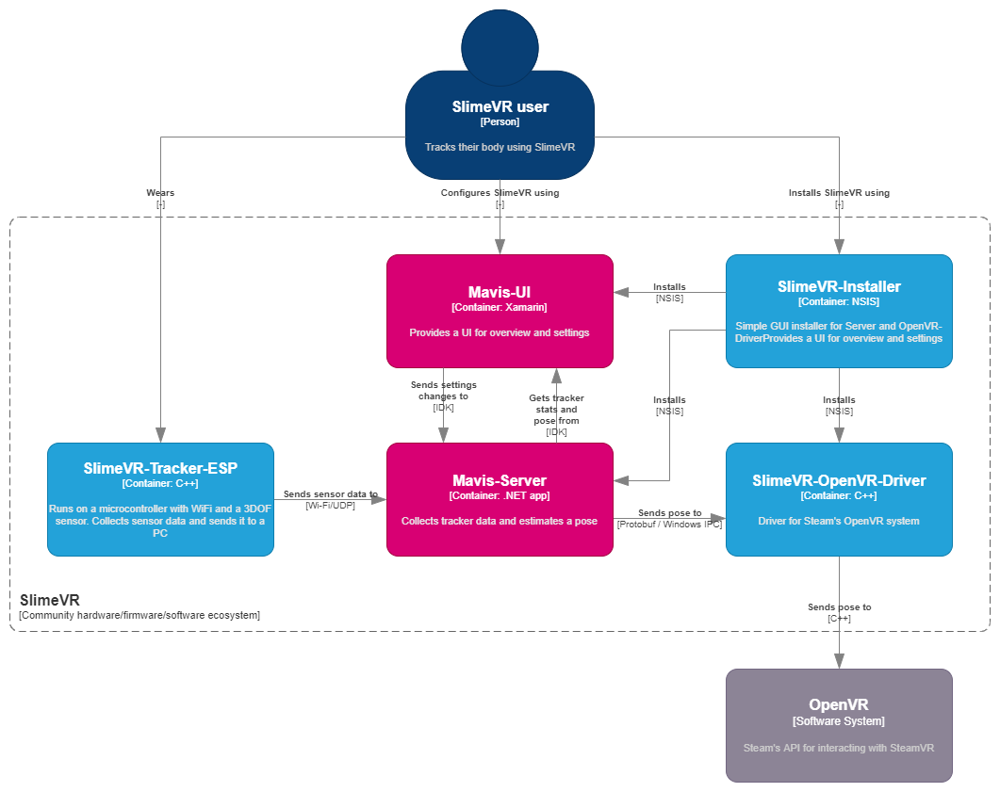
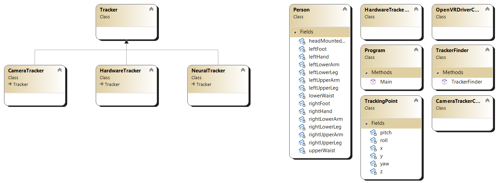

# Mavis-Server

A reimplementation of SlimeVR's server/UI application to do body tracking in a different way.

## C4 Diagrams

Here's a high-level overview of how I'm hoping this project will fit into the SlimeVR ecosystem.

### The old software system:

### The proposed software system:

## Mavis-Server

My main focus will be reimplementing the server. The SlimeVR discord said they aspire to separate the UI app and the server software, so I'll do the same.

### Pose and positioning algorithm

The algorithm will attempt to create a full table of values (x/y/z/pitch/yaw/roll) for all tracking points, regardless of which hardware trackers are actually equipped. We fill in this table in the following order:

- Collection of hardware sensor data
- OpenCV person detection using a webcam
- Tensorflow machine learning program that fills in the gaps, where data from the above two sources is used as the dataset

### Class diagram

